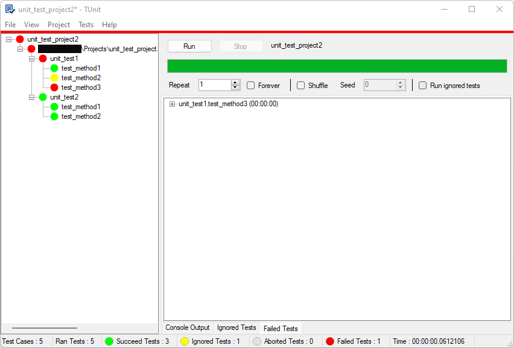

# xtd.tunit.gui.forms

* xtd.tunit.gui.forms is a prototype written in C# to demonstrate the possibility of having a graphical interface for xtd.tunit.
* This project is not intended for the end user.
* It only serves as a base for a future product fully integrated with xtd and written with xtd.
* There are some bugs that linger and the functionality is not completely finished.
* But for a simple prototype, it's not bad.

## If you want more information about xtd.tunit and xtd in general, here are some links to follow

* [website](https://gammasoft71.wixsite.com/xtdpro)
* [wiki](https://github.com/gammasoft71/xtd/blob/master/docs/home.md)
* [github](https://github.com/gammasoft71/xtd) 
* [project](https://sourceforge.net/projects/xtdpro/) 
* [Reference Guide](https://codedocs.xyz/gammasoft71/xtd/index.html)
* [xtd.tunit overview](https://github.com/gammasoft71/xtd/blob/master/docs/guide_tunit_overview.md)
